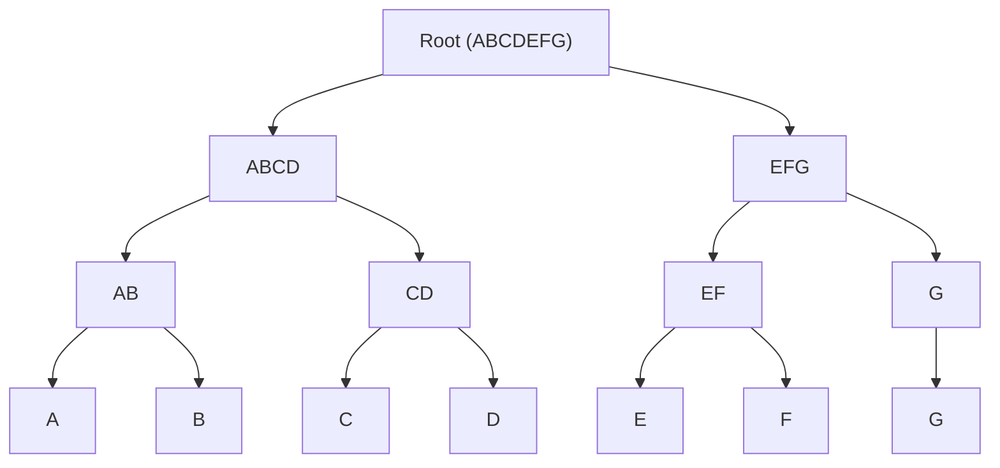

# BUD-10

## Chunked blobs

`draft` `optional`

Breaking large blobs into smaller chunks for distribution

### Chunking method

The client MAY break large blobs into any number or size of chunks. although its recommended to use the size `1Mb` or `4Mb` for small and large chunks

Clients MUST NOT pad the remaining chunk, If clients need privacy they should use random chunk sizes and optionally encrypt the large blob

Clients MUST create a merkle tree using the chunk hashes as the leaf nodes

### Merkle tree encoding

The merkle tree MUST be in the format of `[<root hash (Uint8)>, <left>, <right>]` and be encoded using [`CBOR`](https://cbor.io/)


Example:



```
[Unit8(ABCDEFG),
  [Unit8(ABCD),
    [Unit8(AB),
      Unit8(A),
      Unit8(B)
    ],
    [Unit8(CD),
      Unit8(C),
      Unit8(D)
    ]
  ],
  [Unit8(EFG),
    [Unit8(EF),
      Unit8(E),
      Unit8(F)
    ],
    [Unit8(G),
      Unit8(G)
    ]
  ]
];
```

### Merkle tree storage

Clients MAY choose to store the merkle tree on nostr relays using the `2001` kind event

The event MUST include an `x` tag with the merkle root to the `2001` event

The event MAY include additional metadata tags to help other clients know the filename, mime type or servers to download from

Metadata tags:
  - `name` Filename
  - `summary` A short summary of the file
  - `m` Mime type of file
  - `size` Total size in bytes of the file
  - `x` Merkle root
  - `server` (multiple) Recommended servers to download chunks from
