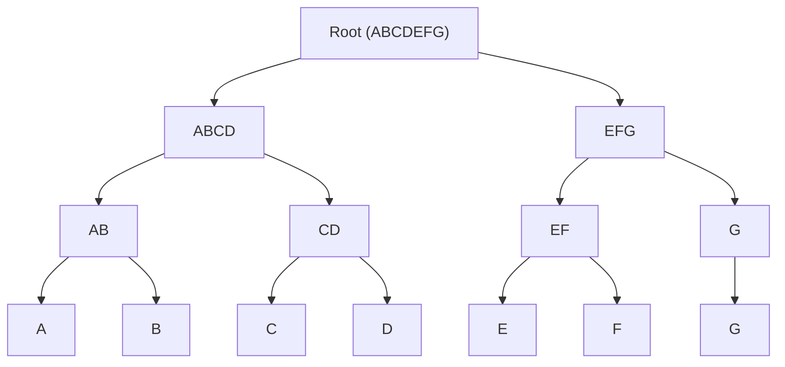

# BUD-10

## Chunked blobs

`draft` `optional`

Breaking large blobs into smaller chunks for distribution

### Chunking method

The client MAY break large blobs into any number or size of chunks. although its recommended to use the size `1Mb` or `4Mb` for small and large chunks

Clients MUST NOT pad the remaining chunk, If clients need privacy they should use random chunk sizes and optionally encrypt the large blob

Clients MUST create a merkle tree using the chunk hashes as the leaf nodes

### Merkle tree encoding

Clients MAY choose to store the merkle tree on nostr relays using the `2001` kind event

The merkle tree MUST be in the format of `[<root hash (Uint8)>, <left>, <right>]`

The merkle tree MUST be stored in the events `content` as a base64 encoded [`CBOR`](https://cbor.io/) object

Clients MUST add an `x` tag with the merkle root to the `2001` event

Example:



```
[Unit8(ABCDEFG),
  [Unit8(ABCD),
    [Unit(AB),
      Unit(A),
      Unit(B)
    ],
    [Unit(CD),
      Unit(C),
      Unit(D)
    ]
  ],
  [Unit(EFG),
    [Unit(EF),
      Unit(E),
      Unit(F)
    ],
    [Unit(G),
      Unit(G)
    ]
  ]
];
```

### Metadata

Clients MAY include additional metadata tags in the `2001` event to help other clients know the filename or mime type

Metadata tags:
  - `name` Filename
  - `summary` A short summary of the file
  - `m` Mime type of file
  - `size` Total size in bytes of the file
  - `x` Merkle root
  - `server` (multiple) Recommended servers to download chunks from
