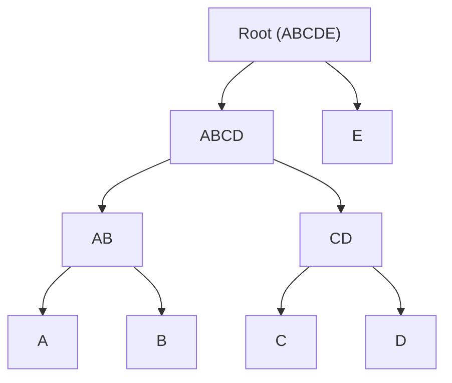

# BUD-10

## Chunked blobs

`draft` `optional`

Breaking large blobs into smaller chunks for distribution

### Chunking

The client MAY break large blobs into any number or size of chunks. although its recommended to use the size `1Mb` or `4Mb` for small and large chunks

Clients MUST NOT pad the remaining chunk, If clients need privacy they should use random chunk sizes and optionally encrypt the large blob

Clients MUST create a merkle tree using the chunk hashes as the leaf nodes

### Publishing

Clients should publish a `2001` kind event after chunking the file in order to store the list of chunks

The events `content` MUST be set to am ordered JSON array of the chunks sha256 hashes. e.g.

```json
[
  "7e668b56a58c7891e0cf263ea3f093b75eebade23d663a45aa9920f347b3d671", // A
  "9b9c44a91396f19fd8700986eb0586dff2dcccf96c75bc2caefef302bcd78da1", // B
  "7a281548f1223664b855b10b08e59e84389ccabeb742517f6cd75eda2724a798", // C
  "fadeccee86b123088bbc452df10e8fbc99d4c2f22a70ef7a35605ec8e439c345", // D
  "5d62398419e6d136771541f3d2215e0ce31b1be45e99dbc64b43a4b734b447ca"  // E
]
```

The event MUST have an `x` tag with the value of the unsorted sha256 [Merkle root](https://en.wikipedia.org/wiki/Merkle_tree)

Example merkle tree:



### Metadata

The `2001` event MAY include additional metadata tags to help other clients know the filename, mime type or servers to download from

Metadata tags:
  - `name` Filename
  - `summary` A short summary of the file
  - `m` Mime type of file
  - `size` Total size in bytes of the file
  - `server` (multiple) Recommended servers to download chunks from

### Examples

Example `2001` event
```json
{
  "id": "9d0a95a2d2681a758ca4023256e62ff71494d8346b62f11601029b1f74b3b933",
  "pubkey": "84ac0424fa2dec0ffd6a1f256afd1d18304cc127081f2c81da499fe4b875f1d6",
  "created_at": 1731405194,
  "kind": 2001,
  "content": "[\"7e668b56a58c7891e0cf263ea3f093b75eebade23d663a45aa9920f347b3d671\",\"9b9c44a91396f19fd8700986eb0586dff2dcccf96c75bc2caefef302bcd78da1\",\"7a281548f1223664b855b10b08e59e84389ccabeb742517f6cd75eda2724a798\",\"fadeccee86b123088bbc452df10e8fbc99d4c2f22a70ef7a35605ec8e439c345\",\"5d62398419e6d136771541f3d2215e0ce31b1be45e99dbc64b43a4b734b447ca\"]",
  "tags": [
    [ "x", "ebb6b0c58ad555db23c9a34e449ea8d37cfc9644cc0982f0facea11d1c3dfab0" ],
    [ "name", "example.mp4" ],
    [ "m", "video/mp4" ],
    [ "size", "4823449" ],
    [ "server", "https://cdn.example.com" ],
    [ "server", "https://nostr.download" ]
  ],
  "sig": "f930eceb7dd8f5bfe9c238e7ec124b6ca34fc335688be1aaa1cb41c33f722c86e23a527aadbed266767d5b6224451bddeac9cf9b43ac7c068c8388cbdbcbd189"
}
```
